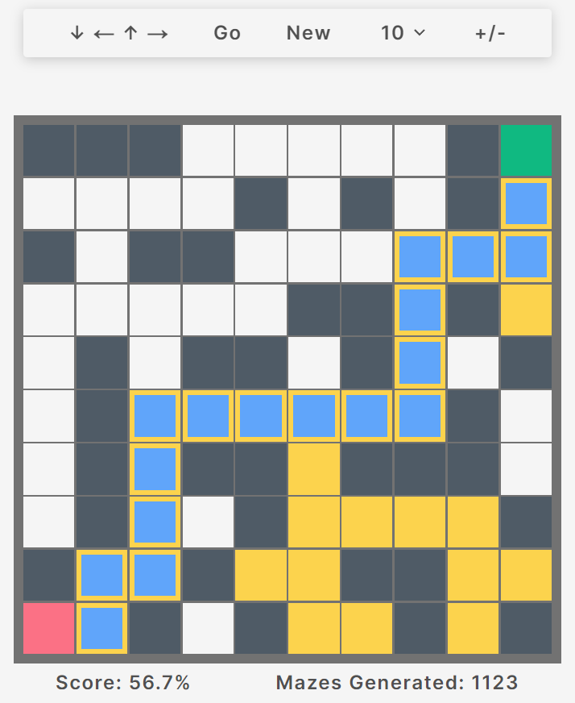

# The GRID

An educational game, both for myself and anyone else interesting in pathfinding. Test your ability to predict the AI path across an infinite number of randomly-generated grids!

## Tenchnologies Used

- Next.js
- Typescript
- CSS
- Supabase

## Features

- Randomized grid layouts at different sizes (10x10, 15x15, etc..)
- DFS pathfinding, decision-making changes based on start/end positions
- Touch to select cells (or click & click + drag on laptop/desktop)
- Tracks total number of grids generated for all users
- Provides percentage based scores
- Grid resizing for visibility
- Fully responsive design

## How To Play

1. Start by selecting the size of the grid you wish to use and click "New"
2. The AIs decision making for the grid is displayed at the top left
3. Select cells to fill out the grid, moving from green to red in the path you think the AI will take (see detailed instructions in game)
4. Click "Go" to have the computer solve the grid
5. Colors in the grid will change based on where the computer moves. Blue cells are user-visited, yellow cells are AI-visited and blue cells outlined in yellow are cells where both the user and AI have visited
6. Your score will be displayed at the bottom left

